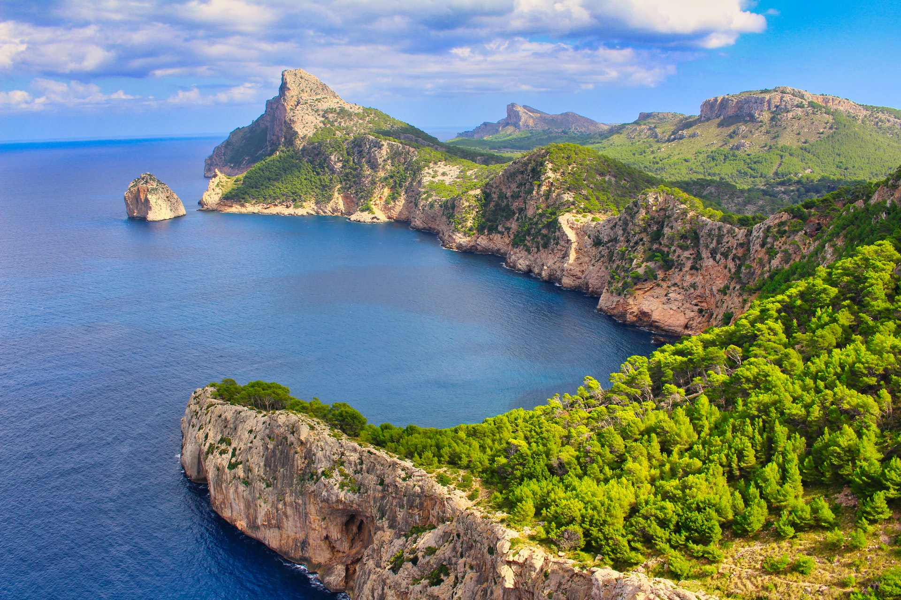
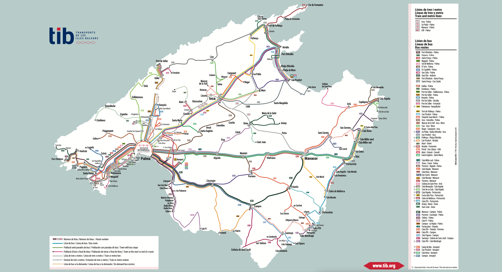
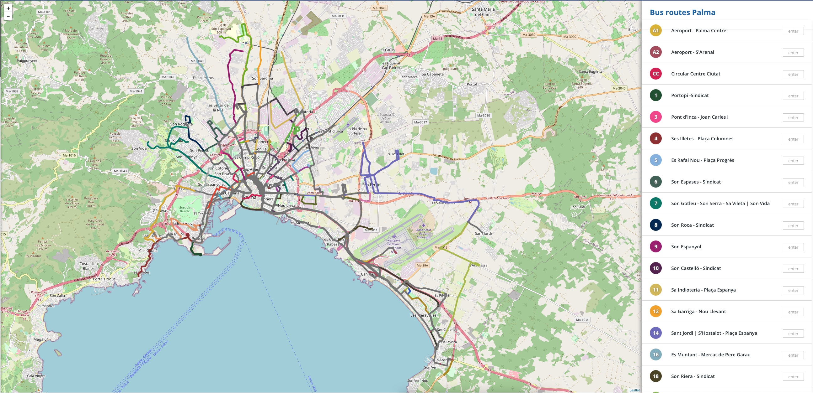

# Vacaciones en Mallorca

<small>[unsplash](https://unsplash.com/photos/jJT1cnE4SZ8)</small>

* 2 Wochen - 2 Orte
* [Reisehinweise](https://www.auswaertiges-amt.de/de/aussenpolitik/laender/spanien-node/spaniensicherheit/210534)
* Steckdosen Check: Typ C und F, 230V/50Hz -> kein Adapter
* [Notfallnumern](https://www.mallorca.org/notfallnummern.html)
  * Allgemeiner Notruf: 112
  * Notarzt: 061
* Leitungswasser: trinkbar, evlt. leichter salziger- oder Chlorgeschmack
  * [Ausnahme](https://www.mallorcamagazin.com/nachrichten/lokales/2022/02/20/98313/diesen-orten-auf-mallorca-sollte-leitungswasser-nicht-getrunken-werden.html): Santanyí, der Ort Santa Margalida sowie Costitx, Sineu, s'Horta und Manacor
  * [Palma Wasser Qualität](https://www.emaya.es/ca/cicle-aigua/qualitat-aigua/graficasanalisis/)
  * [Wasser Qualität Spanien (2020)](https://www.sanidad.gob.es/profesionales/saludPublica/docs/INFORME_AC_2020_ANEXO_I_ZonaAbastecimiento.pdf)

## To-Do

* Koffer kaufen
* ¡Aprender Español!
* Vorfreude!

## Packliste

* Kleidung
  * Schuhe
  * Badekleidung
* Rucksack
* Reisedokumente
* Ladekabel
* Kamera
* Sonnencreme
* Bad
  * Zahnbürste
  * Handtücher
  * Duschgel
  * Haarspray
* Powerbank

## Flüge

* **Hinflug**: STR -> PMI, 05. Sep. 13:37
* **Rückflug**: PMI -> STR, 19. Sep. 13:37

Flüge Kompensieren: https://www.atmosfair.de/de/kompensieren/flug/

## Unterkunft

* **Airbnb Palma**
  * 05.09 - 12.09
  * 80€ / Nacht
* **Airbnb Manacor**
  * 12.09 - 19.09
  * 90€ / Nacht

Gesamt: **1190€**

## Verkehrsmittel

### Öffentliche Verkehrsmittel

* [TIB](https://www.tib.org/es/web/ctm/): Bus, Bahn, Metro über ganze Insel

  

* [EMT](https://www.emtpalma.cat/es/inicio): Bus Großraum Palma

  

### Fahrrad

* https://www.mallorca.com/de/aktivitaeten/mallorca-fahrradverleih
* https://radverleih-mallorca.com/anbieter/

### Auto

* https://www.mallorca.com/de/urlaub/mobil-auf-mallorca

## Reiseplan

* **Palma**
  1. Tag: Anreise
  2. Tag
     * Strand
  3. Tag
     * Stadt erkunden
     * Einkaufen
     * Catedral de Mallorca
  4. Tag
     * Alcudia Old Town und Cap de Formentor (Norden)
  5. Tag
     * Serra de Tramuntana (Westen)
  6. Tag
     * Strand
  7. Tag
     * Stadt erkunden
     * Tapas
  8. Tag: Umzug
* **Manacor**
  1. Tag: Umzug
  2. Tag
     * Stadt erkunden
  3. Tag
     * Fahrrad: Via Verde Manacor-Arta
  4. Tag
     * Cuevas de Arta
  5. Tag
     * Cala Domingos
  6. Tag
     * Castell de Capdepera
  7. Tag
     * Erholung
  8. Tag: Abreise